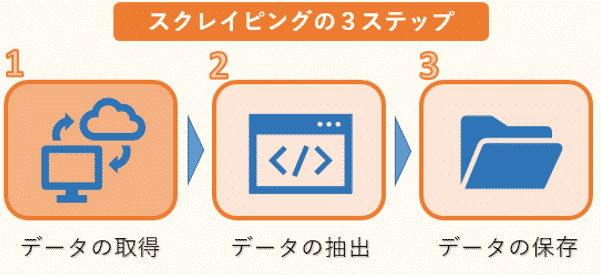
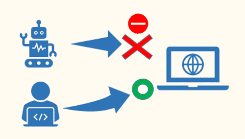

# WebCrawler

# fake-useragent

スクレイピングをする際、User-Agent を設定するのに便利なのが、fake-useragent になります。
fake-useragent を利用することにより、人間がアクセスしているのと変わらない User-Agent の値を自動的に設定することができます。

# 参考サイト

https://www.sejuku.net/blog/69383
